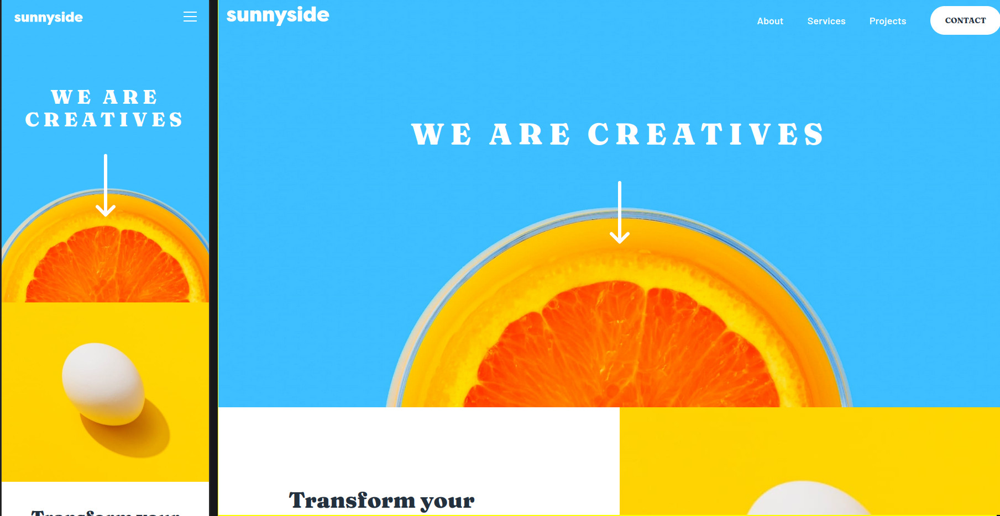

# Frontend Mentor - Sunnyside agency landing page solution

Hello! Thank you for visiting this repository. This is a solution to the [Sunnyside agency landing page challenge on Frontend Mentor](https://www.frontendmentor.io/challenges/sunnyside-agency-landing-page-7yVs3B6ef). Frontend Mentor challenges help you improve your coding skills by building realistic projects.

## Table of contents

- [Overview](#overview)
  - [The challenge](#the-challenge)
  - [Screenshot](#screenshot)
- [My process](#my-process)
  - [Built with](#built-with)
  - [What I learned](#what-i-learned)
  - [Continued development](#continued-development)
- [Author](#author)

## Overview

The challenge is to build out this landing page and get it looking as close to the design as possible.

### The challenge

Users should be able to:

- View the optimal layout for the site depending on their device's screen size
- See hover states for all interactive elements on the page

My solution presented here is my best attempt at the above. I welcome feedback on how the landing page works on your device as well as critique of the code I have used.  

### Screenshot

Screenshot of the header of the solution of mobile and desktop views



## My process

I styled the mobile layout, then the desktop layout, finally I worked on the finishing touches like the dropdown and some of the more subtle styles like the 'Learn More' links.

### Built with

- Semantic HTML5 markup
- CSS custom properties
- JavaScript

### What I learned

Displaying the background images was tricky at first because I had little experience using background images but learned a lot about them in this project. After trial and error I found that background-position: center and background-size: cover were the styles needed for this project.

```css
header {
  background-image: url("images/mobile/image-header.jpg");
  background-repeat: no-repeat;
  background-position: center center;
  background-size: cover;
  width: 100%;
  min-height: 550px;
}
```

At first I thought the 'Learn More' links in the design had bottom borders, but I realized from the style and hover behaviour they bottom lines must be their own elements. The name is pretty verbose perhaps, but this creates a nice underline effect.

```css
.container__link-underline--transform {
  height: 10px;
  width: 137px;
  background-color: var(--clr-yellow);
  border-radius: 3rem;
  transform: translateY(-75%);
  position: relative;
  z-index: -1;
  opacity: .25;
  transition: opacity .3s ease-out;
}

.container__link:hover .container__link-underline--transform {
  opacity: 1;
}
```

I also spent a long time trying to figure out how to get the mobile dropdown menu to close when the screen is clicked/tapped on somewhere other than the menu. Fortunately I persisted and the following code does that.

```js
window.addEventListener("click", function(event) {

  let menu = document.getElementById("dropdown-menu");
  let button = document.getElementById("hamburger");

  if (event.target != menu && event.target != button) {
    if (menu.classList.contains("show-dropdown")) {
      menu.classList.remove("show-dropdown");
    }
  }
});
```

### Continued development

I am excited that my HTML and CSS skills are at a level where I can build things like this. However, as I start taking on larger projects I think I have to look at more pragmatic ways to organise CSS. I was going to refactor this CSS into SASS but ran out of time. Also, I want to use React to take on future Frontend Mentor challenges.

## Author

- Website - [My showcase page](https://michagodfrey.github.io/)
- Frontend Mentor - [@michagodfrey](https://www.frontendmentor.io/profile/michagodfrey)
- Twitter - [@Michael07865192](https://twitter.com/Michael07865192)
